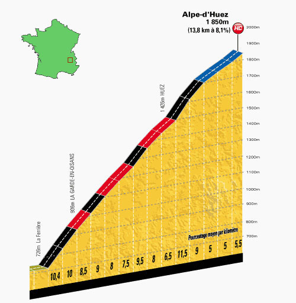

# Professional Cycling Scatterplot Visualization

This is a simple data visualization project I created using a dataset I found from [freeCodeCamp](https://raw.githubusercontent.com/FreeCodeCamp/ProjectReferenceData/master/cyclist-data.json) using the popular data visualization library [D3.js](https://d3js.org/).

Alpe d'Huez is extremely famous in the Tour De France. It was the first mountaintop summit ever featured in the tour, at 14.454km long with an average gradient of 8.1. Since 1994 ascents have been timed and most of the fastest climbers have something in common; they were accused of doping at some point in the career, most notably Marco Pantani and Lance Armstrong. Pantani holds the record at
37' 35" going 23.08 km/h. [Source](https://en.wikipedia.org/wiki/Alpe_d%27Huez#Cycle_racing)

An image of the climb:

## Getting Started

Check out the [live demo](https://ryanjmack.github.io/Professional-Cycling-Scatterplot/)!

## Built With

* HTML/SCSS
* ES6 JavaScript
* D3.js
* Gulp for automating tasks

## Final Thoughts
This was another great mini project while learning D3.js

I am still figuring out how to best do things in D3, especially formatting the axes how I envision them. I have a couple more projects that I will be doing!

---
## License

This project is licensed under the MIT License - see the [LICENSE.md](https://github.com/ryanjmack/Professional-Cycling-Scatterplot/blob/master/LICENSE.md) file for details
